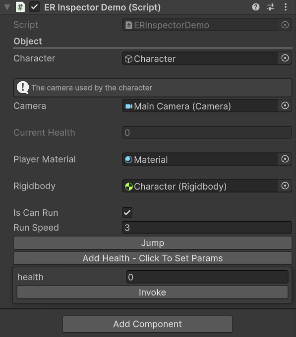

<h1 align="left">ER Inspector</h1>

###

<p align="left">ER Inspector is a custom Unity tool designed to help developers organize the Inspector view in a cleaner, more informative, and interactive way. With this tool, you can add visual elements such as titles, info boxes, or buttons all controllable through simple attributes within your scripts. This tool is especially useful for improving editor workflows and clarifying the structure and purpose of variables or methods in a component.</p>

[](https://opensource.org/licenses/MIT)
[](https://www.codefactor.io/repository/github/edenrompas/er-inspector)

###

<h2 align="left">Features</h2>

###

<ul align="left">
  <li><strong>Title</strong><br>Adds a text heading above a variable, useful for grouping or highlighting sections in the Inspector.</li><br>
  
  ```csharp
  [Title("Enter the title")]
  private string _title;
  ```
  <li><strong>Info Box</strong><br>Displays an information box containing explanations or notes related to a serialized variable, helpful for documentation or usage guidance.</li><br>
  
  ```csharp
  [InfoBox("Enter description")]
  private int _infoBox;
  ```
  <li><strong>Show If</strong><br>Conditionally displays a variable in the Inspector only if a specific boolean value is true. This helps keep the Inspector clean and only shows relevant data when needed.</li><br>
  
  ```csharp
  [ShowIf("Enter boolean variables")]
  private int _showIf;
  ```
  <li><strong>Read Only</strong><br>Makes a variable viewable but not editable in the Inspector. Ideal for displaying runtime data or values that shouldn't be modified manually.</li><br>

  ```csharp
  [ReadOnly]
  private int _readOnly;
  ```
  <li><strong>Asset Only</strong><br>Restricts variable assignment to assets only (e.g., prefabs, sprites, materials). It prevents scene objects from being assigned to the variable.</li><br>

  ```csharp
  [AssetOnly]
  private int _assetOnly;
  ```
  <li><strong>Scene Only</strong><br>Opposite of Asset Only, this limits variable references to scene objects (Hierarchy), disallowing asset assignments.</li><br>
  
  ```csharp
  [SceneOnly]
  private int _sceneOnly;
  ```
  <li><strong>Button</strong><br>Enables calling a method directly from the Inspector using a button, great for debugging or executing editor-side functions quickly.</li>

  ```csharp
  [Button]
  public void Button() {}
  ```
</ul>

###

<h2 align="left">Highlight</h2>

###

<p align="center">
  <table>
    <tr>
      <td align="center"><strong>Code Editor</strong></td>
      <td align="center"><strong>Inspector Unity</strong></td>
    </tr>
    <tr>
      <td align="center">
        
      </td>
      <td align="center">
        
      </td>
    </tr>
  </table>
</p>

###
